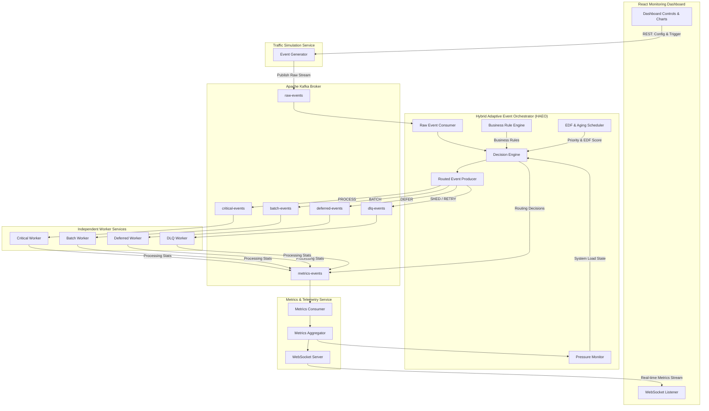

# Adaptive Event Orchestration Platform (AEOP)

> **Dynamic, Load-Aware, EDF-Inspired Event Scheduling & Orchestration System**

[](#high-level-architecture)
[](#technology-stack)
[](#technology-stack)
[](#technology-stack)

---

## 📌 Executive Summary & Problem Statement

Modern high-concurrency cloud environments frequently encounter chaotic traffic surges triggered by real-world events such as **Flash Sales, Big Billion Days, Black Friday events, Payment Spikes, and Notification Storms**. 

Traditional event processing architectures rely on static FIFO queue consumers or simple threshold-based rate limiters. Under severe load, static queues suffer from:
1. **Queue Head-of-Line Blocking**: Low-priority background jobs (e.g., telemetry logs or analytics clicks) block high-revenue financial transactions (e.g., Payment checkouts).
2. **Cascading Latency Failures**: Unchecked latency causes downstream service starvation and connection pool exhaustion.
3. **Rigid Degradation**: Systems either accept all traffic until catastrophic collapse or apply coarse-grained global rate-limiting, dropping critical transactions indiscriminately.

The **Adaptive Event Orchestration Platform (AEOP)** solves this by introducing a **Hybrid Adaptive Event Orchestrator (HAEO)**. AEOP continuously evaluates system health metrics (CPU, queue occupancy, latency, worker utilization) alongside business rules, event aging, and Earliest Deadline First (EDF) mechanics to dynamically route, batch, defer, or shed incoming event streams in real time.

---

## 🌟 Key Capabilities & Features

- 🧠 **Hybrid Adaptive Event Orchestrator (HAEO)**: Evaluates dynamic multi-variable pressure formulas before routing events.
- ⏱️ **EDF & Aging Priority Engine**: Combines Earliest Deadline First scheduling with starvation-prevention aging multipliers.
- ⚡ **Multi-Scenario Traffic Simulator**: Simulates Gradual Spikes, Sudden Spikes, Random Bursts, Flash Sales, and Custom Traffic profiles.
- 📊 **Real-time Control & Telemetry Dashboard**: Live WebSocket visualizer showing queue occupancy, pressure levels, latency histograms, worker utilization, and adaptive decision streams.
- 🛡️ **Guaranteed Business SLA Rules**: Strict rule engine enforcing zero-drop policies for Payments/Orders while dynamically shedding or deferring low-priority events.
- ⚙️ **Fully Decoupled Kafka Architecture**: Independent worker pools communicating exclusively via dedicated Kafka topics.

---

## 🛠️ Technology Stack

| Layer | Technology | Purpose |
| :--- | :--- | :--- |
| **Frontend** | React 18, Vite, Recharts, Lucide Icons | Real-time monitoring UI & traffic simulation control dashboard |
| **Backend API** | Python 3.11+, FastAPI, WebSockets, Uvicorn | RESTful control plane & WebSocket metric broadcasting |
| **Core Orchestration** | Python AsyncIO, `confluent-kafka` / `aiokafka` | High-performance async event routing & decision engine |
| **Message Broker** | Apache Kafka, Zookeeper / KRaft | Distributed event stream backbone |
| **Workers** | Python AsyncIO Worker Services | Microservices consuming routed streams & publishing metrics |
| **Containerization** | Docker, Docker Compose | Orchestration of all microservices & Kafka cluster |

---

## 🏗️ Production-Ready Folder Structure

```
d:/VCET/
├── docker-compose.yml              # Complete container orchestration setup
├── README.md                       # Main project documentation
├── docs/                           # Exhaustive technical documentation suite
│   ├── ARCHITECTURE.md             # System architecture & mathematical engine breakdown
│   ├── WORKFLOW.md                 # Detailed dataflow, sequence, and life of an event
│   ├── KAFKA_TOPICS.md             # Schemas, topic topology & partition strategies
│   ├── API_DOCUMENTATION.md        # REST & WebSocket protocol specifications
│   ├── CONFIGURATION_GUIDE.md      # Environment variable & dynamic rule parameters
│   ├── DOCKER_SETUP.md             # Container deployment & networking guide
│   └── TESTING_PLAN.md             # Unit, integration, and load testing strategy
├── config/                         # System configuration files
│   ├── haeo_rules.json             # Dynamic business & routing rules configuration
│   └── traffic_profiles.json       # Pre-configured scenario definitions
├── services/                       # Independent microservices
│   ├── common/                     # Shared utilities & Kafka helpers
│   │   ├── __init__.py
│   │   ├── kafka_producer.py       # Thread-safe Kafka producer wrapper
│   │   ├── kafka_consumer.py       # Resilient Kafka consumer wrapper
│   │   ├── models.py               # Pydantic schemas & Data classes
│   │   └── logger.py               # Structured JSON logger
│   ├── simulator/                  # Traffic Simulation Service
│   │   ├── main.py
│   │   ├── generator.py            # Traffic generation logic & scenarios
│   │   └── config.py
│   ├── haeo/                       # Hybrid Adaptive Event Orchestrator
│   │   ├── main.py
│   │   ├── decision_engine.py      # Core adaptive decision algorithm
│   │   ├── pressure_monitor.py     # Real-time pressure score evaluator
│   │   ├── edf_scheduler.py        # Aging & EDF deadline priority calculator
│   │   └── rule_engine.py          # Business SLA validation engine
│   ├── workers/                    # Worker microservices
│   │   ├── critical_worker.py      # Consumes critical-events topic
│   │   ├── batch_worker.py         # Consumes batch-events topic
│   │   ├── deferred_worker.py      # Consumes deferred-events topic
│   │   └── dlq_worker.py           # Consumes dlq-events topic
│   └── metrics_service/            # Telemetry Aggregation Service
│       ├── main.py
│       ├── aggregator.py           # Metric rollup & pressure computing engine
│       └── ws_server.py            # WebSocket streaming server
└── frontend/                       # React Monitoring Dashboard
    ├── package.json
    ├── vite.config.js
    ├── index.html
    └── src/
        ├── assets/
        ├── components/
        │   ├── Header.jsx
        │   ├── TrafficControls.jsx
        │   ├── PressureGauge.jsx
        │   ├── QueueMetricsChart.jsx
        │   ├── LatencyChart.jsx
        │   ├── DecisionTimeline.jsx
        │   └── WorkerStatusCard.jsx
        ├── hooks/
        │   └── useWebSocket.js
        ├── services/
        │   └── api.js
        ├── App.jsx
        └── main.jsx
```

---

## 🏛️ High-Level Architecture Diagram



---

## 📊 Business Rules Matrix

| Event Type | Priority Base | Allow Drop? | Allow Batch? | Max Delay Allowed | Target Queue | Default Behavior |
| :--- | :--- | :--- | :--- | :--- | :--- | :--- |
| **PAYMENT** | `CRITICAL (100)` | ❌ Never | ❌ Never | 0 ms | `critical-events` | Instant high-priority dispatch |
| **ORDER** | `HIGH (80)` | ❌ Never | ❌ Never | < 100 ms | `critical-events` | Short delay tolerated under load |
| **REFUND** | `HIGH (90)` | ❌ Never | ❌ Never | < 50 ms | `critical-events` | Urgent financial transaction |
| **INVENTORY**| `MEDIUM (50)` | ❌ Never | ✅ Yes | < 2000 ms | `batch-events` | Micro-batching supported |
| **NOTIFICATION**| `LOW (30)` | ⚠️ Degraded | ✅ Yes | < 5000 ms | `batch-events` / `deferred-events` | Defer or batch based on pressure |
| **CLICK** | `TRIVIAL (10)`| ✅ Yes | ✅ Yes | < 10000 ms | `deferred-events` / `dlq-events` | Shed under HIGH/CRITICAL pressure |
| **LOG** | `TRIVIAL (5)` | ✅ Yes | ✅ Yes | Unlimited | `deferred-events` / `dlq-events` | Shed first during load spikes |

---

## 🧮 Adaptive Scheduling Engine Mechanics

The HAEO core decision engine calculates two primary indices before assigning an event to a target outcome (`PROCESS`, `BATCH`, `DEFER`, `SHED`, `RETRY`).

### 1. System Pressure Score ($P$)

$$P = w_q \cdot \left(\frac{Q_{current}}{Q_{max}}\right) + w_u \cdot U_{worker} + w_l \cdot \min\left(1, \frac{L_{avg}}{L_{target}}\right) + w_c \cdot CPU_{util}$$

Where default weights are $w_q = 0.35, w_u = 0.25, w_l = 0.25, w_c = 0.15$.

- **LOW Pressure** ($P < 0.35$): 100% Passthrough via `PROCESS`.
- **MEDIUM Pressure** ($0.35 \le P < 0.65$): Enable adaptive micro-batching for INVENTORY, NOTIFICATION, and LOGS.
- **HIGH Pressure** ($0.65 \le P < 0.85$): Defer CLICKS and LOGS to `deferred-events`, batch NOTIFICATIONS, delay ORDERS up to 100ms.
- **CRITICAL Pressure** ($P \ge 0.85$): Activate Load Shedding. Instantly drop CLICKS and LOGS (`SHED`), route non-critical low EDF score events to DLQ, guarantee 100% capacity for PAYMENTS and ORDERS.

### 2. Effective EDF & Aging Priority Score ($S_{event}$)

$$S_{event} = B_{priority} + \alpha \cdot T_{waiting} + \beta \cdot \max\left(0, 1 - \frac{T_{deadline} - T_{current}}{T_{max\_deadline}}\right)$$

Where $B_{priority}$ is the base weight, $T_{waiting}$ is aging in seconds, and the third term captures Earliest Deadline First urgency. As an event waits in the system, its score increases dynamically to prevent starvation.

---

## 🚦 Traffic Scenarios Supported

1. **Normal Traffic**: Constant baseline load (e.g., 50-100 events/sec).
2. **Gradual Spike**: Linear ramp-up over a configurable duration (e.g., 50 -> 1000 events/sec over 30s).
3. **Sudden Spike**: Instantaneous jump to peak load (e.g., Flash sale opening bell).
4. **Random Burst**: Unpredictable Poisson-distributed micro-bursts of traffic.
5. **Custom Traffic**: Custom JSON scenario defining event distribution ratios and load curves.

---

## ⚡ Quick Start & Running Instructions

### Prerequisites
- Docker Engine v24.0+ & Docker Compose v2.20+
- Python 3.11+ (for local development)
- Node.js 18+ (for frontend local development)

### Running via Docker Compose (Recommended)

1. **Clone & Navigate**:
   ```bash
   cd d:/VCET
   ```

2. **Launch full stack**:
   ```bash
   docker-compose up --build -d
   ```

3. **Verify running services**:
   ```bash
   docker-compose ps
   ```

4. **Access UI & Interfaces**:
   - **React Monitoring Dashboard**: `http://localhost:3000`
   - **FastAPI Control API Docs**: `http://localhost:8000/docs`
   - **Metrics WebSocket**: `ws://localhost:8000/ws/metrics`
   - **Kafka UI**: `http://localhost:8080`

---

## 🚀 Future Roadmap & Scope
- **Dynamic Worker Auto-scaling**: Scale worker Docker containers dynamically based on queue pressure.
- **Persistent Analytics Store**: Integrate ClickHouse / TimescaleDB for long-term historical decision analytics.
- **Machine Learning Predictive Router**: Train an LSTM model to predict pressure spikes 5 seconds ahead of time.

---
*Created as part of the Adaptive Event Orchestration Platform Specification.*
