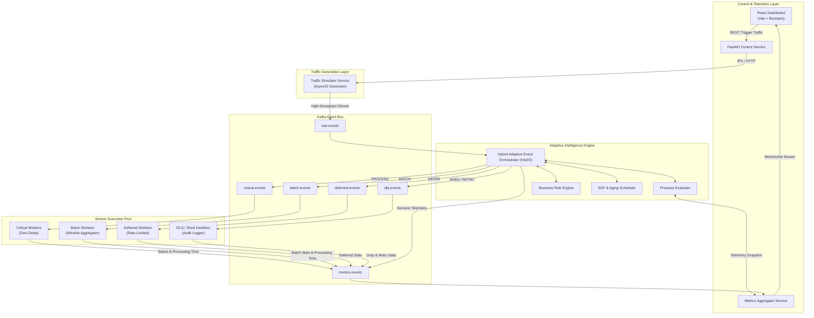

# System Architecture & Core Innovation

## 1. Overview

The **Adaptive Event Orchestration Platform (AEOP)** is designed around a multi-tier microservice architecture where intelligence is decoupled from transport and execution.

Traditional message brokers use fixed queues and standard consumers. When traffic spikes occur, queues fill up uniformly, resulting in high latency for all events. AEOP introduces the **Hybrid Adaptive Event Orchestrator (HAEO)**, an inline intelligent router that continuously senses downstream pressure, computes effective event priorities, and routes messages across specialized Kafka topic channels.

---

## 2. System Architecture Diagrams

### 2.1 Component Topology Diagram



---

## 3. Hybrid Adaptive Event Orchestrator (HAEO) Core Engine

The HAEO core is driven by three distinct engines running in a concurrent loop:

```
                          Incoming Event
                                │
                                ▼
                   ┌─────────────────────────┐
                   │  Business Rule Engine   │
                   └────────────┬────────────┘
                                │
                                ▼
                   ┌─────────────────────────┐
                   │ EDF & Aging Scheduler   │
                   └────────────┬────────────┘
                                │
                                ▼
                   ┌─────────────────────────┐
                   │ Pressure State Evaluator│
                   └────────────┬────────────┘
                                │
                                ▼
                   ┌─────────────────────────┐
                   │    Decision Engine      │
                   └────────────┬────────────┘
                                │
        ┌───────────────┬───────┴───────┬───────────────┐
        ▼               ▼               ▼               ▼
    PROCESS           BATCH           DEFER           SHED
(critical-events) (batch-events) (deferred-events) (dlq-events)
```

---

## 4. Mathematical Modeling & Algorithmic Design

### 4.1 System Pressure Score Calculation ($P$)

The pressure level of the ecosystem is evaluated using a weighted multi-factor composite formula:

$$P = w_q \cdot \mathcal{Q} + w_u \cdot \mathcal{U} + w_l \cdot \mathcal{L} + w_c \cdot \mathcal{C}$$

Where:
- $\mathcal{Q} = \frac{\text{Current Queue Length}}{\text{Max Queue Capacity}}$ (Queue Occupancy Ratio)
- $\mathcal{U} = \frac{\text{Active Workers}}{\text{Total Worker Capacity}}$ (Worker Utilization Ratio)
- $\mathcal{L} = \min\left(1.0, \frac{\text{Average Moving Latency (ms)}}{\text{Target Max Latency (ms)}}\right)$ (Latency Pressure Ratio)
- $\mathcal{C} = \frac{\text{Current CPU Load \%}}{100}$ (System CPU Ratio)
- Default Weights: $w_q = 0.35, w_u = 0.25, w_l = 0.25, w_c = 0.15$ (Constraint: $\sum w_i = 1.0$)

#### Pressure Level Thresholds:
- **LOW** ($P < 0.35$): System operating under nominal capacity.
- **MEDIUM** ($0.35 \le P < 0.65$): Moderate queue buildup detected.
- **HIGH** ($0.65 \le P < 0.85$): Latency degradation occurring; non-critical throttling initiated.
- **CRITICAL** ($P \ge 0.85$): Near-saturation state; load shedding activated.

---

### 4.2 Effective Priority Score ($S_{event}$)

To prevent starvation of low-priority events while respecting deadlines (Earliest Deadline First), every event score $S_{event}$ is calculated dynamically upon ingestion:

$$S_{event} = B_{type} + \alpha \cdot T_{age} + \beta \cdot U_{deadline}$$

Where:
- $B_{type}$: Static Base Priority score assigned to event type:
  - `PAYMENT`: 100
  - `REFUND`: 90
  - `ORDER`: 80
  - `INVENTORY`: 50
  - `NOTIFICATION`: 30
  - `CLICK`: 10
  - `LOG`: 5
- $T_{age} = T_{current} - T_{arrival}$: Waiting time in seconds.
- $\alpha$: Aging Multiplier coefficient ($\alpha = 2.5$ points/sec). Ensures that older events gain priority over newly arrived equal-base-priority events.
- $U_{deadline}$: Deadline Urgency factor:
  $$U_{deadline} = \max\left(0, 1.0 - \frac{T_{deadline} - T_{current}}{T_{max\_allowed\_deadline}}\right)$$
- $\beta$: Deadline Urgency Multiplier ($\beta = 40.0$).

---

## 5. Decision Routing Matrix

The Routing Engine applies the matrix below based on $(P, S_{event}, \text{EventType})$:

| Event Type | LOW Pressure ($P < 0.35$) | MEDIUM Pressure ($0.35 \le P < 0.65$) | HIGH Pressure ($0.65 \le P < 0.85$) | CRITICAL Pressure ($P \ge 0.85$) |
| :--- | :--- | :--- | :--- | :--- |
| **PAYMENT** | `PROCESS` | `PROCESS` | `PROCESS` | `PROCESS` |
| **ORDER** | `PROCESS` | `PROCESS` | `PROCESS` (Delay < 100ms) | `PROCESS` |
| **REFUND** | `PROCESS` | `PROCESS` | `PROCESS` | `PROCESS` |
| **INVENTORY** | `PROCESS` | `BATCH` (Size: 10) | `BATCH` (Size: 25) | `DEFER` |
| **NOTIFICATION**| `PROCESS` | `BATCH` (Size: 20) | `DEFER` | `DEFER` |
| **CLICK** | `PROCESS` | `DEFER` | `DEFER` | `SHED` |
| **LOG** | `PROCESS` | `DEFER` | `SHED` | `SHED` |

---

## 6. Worker Architectures

### 6.1 Critical Worker
- Consumes from `critical-events`.
- Zero-wait processing loop with immediate ACK.
- Dedicated concurrency pool.

### 6.2 Batch Worker
- Consumes from `batch-events`.
- Implements dynamic time-window (e.g., 200ms) or max count (e.g., 25 items) micro-batching.
- Reduces network I/O roundtrips by 80%+ under load.

### 6.3 Deferred Worker
- Consumes from `deferred-events`.
- Rate-limited worker consuming during system troughs.
- Monitors HAEO pressure feedback; pauses processing when pressure exceeds `HIGH`.

### 6.4 DLQ Worker
- Consumes from `dlq-events`.
- Handles shed metrics logging, audit trails, and retry queuing.

---
