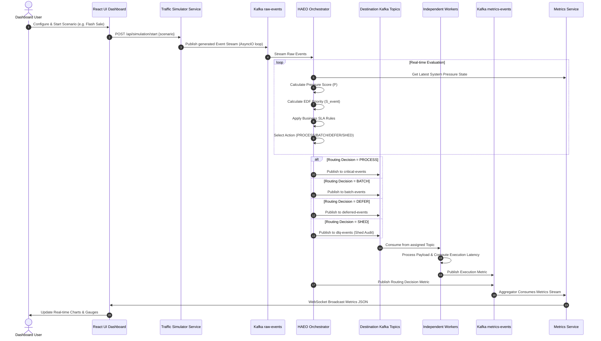

# System Workflow & Data Lifecycle

## 1. End-to-End Operational Lifecycle

This document describes the step-by-step dataflow of an event in the Adaptive Event Orchestration Platform (AEOP).

---

## 2. Phase-by-Phase Workflow Details

### Phase 1: Traffic Generation Workflow
1. User selects a simulation profile on the React Dashboard (e.g. *Gradual Spike*, *Flash Sale*, *Random Burst*).
2. React frontend sends configuration parameters (`base_eps`, `spike_multiplier`, `ramp_up_sec`, `distribution`) to `/api/simulation/start`.
3. Traffic Simulator runs an AsyncIO loop publishing synthetic events to `raw-events` Kafka topic with high-resolution microsecond timestamps (`arrivalTime`).

---

### Phase 2: Orchestration & Routing Workflow (HAEO Engine)
1. **Consumes** batches of raw events from `raw-events` topic using high-performance `aiokafka` consumer.
2. **Evaluates Pressure**: Fetches latest system metrics (queue length, worker latency, CPU) to compute current $P \in [0.0, 1.0]$.
3. **Calculates Priority**: Evaluates $S_{event}$ taking into account event base priority, current age, and EDF deadline.
4. **Applies SLA Matrix**: Determines target route based on rules:
   - **PAYMENT**: Must ALWAYS route to `critical-events`.
   - **ORDER**: Must NEVER drop; allowed delay < 100ms.
   - **INVENTORY / NOTIFICATION**: Batching allowed under MEDIUM/HIGH pressure.
   - **CLICK / LOG**: Deferred or Shed under HIGH/CRITICAL pressure.
5. **Dispatches**: Writes event to target Kafka topic (`critical-events`, `batch-events`, `deferred-events`, or `dlq-events`).

---

### Phase 3: Worker Processing Workflow
1. **Critical Workers**: Process items sequentially with maximum concurrency. Publish latency metric to `metrics-events`.
2. **Batch Workers**: Collect messages up to `batch_size` (e.g., 25) or `window_ms` (e.g., 200ms). Execute micro-batch processing. Publish batch performance stats to `metrics-events`.
3. **Deferred Workers**: Consume from `deferred-events` at a rate-limited cadence during low/medium pressure periods.
4. **DLQ Workers**: Log shed events and calculate drop metrics.

---

### Phase 4: Telemetry & Visualization Workflow
1. **Metrics Aggregator**: Consumes from `metrics-events` topic.
2. **Calculates Windowed Metrics**:
   - Total Throughput (events/sec)
   - Average Processing Latency (ms)
   - Worker Utilization %
   - Dropped Events Count
   - Current System Pressure Score
3. **Pushes to UI**: Broadcasts state payload every 500ms over WebSocket connection to React Dashboard.

---
